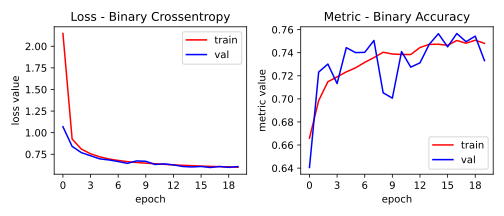
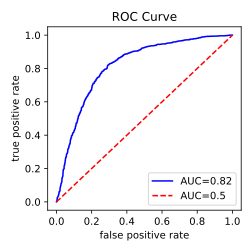

# Airbus Ship Detection Challenge

[1]: https://www.kaggle.com/c/airbus-ship-detection/

This repository contains my research of the [Airbus Ship Detection Challenge][1].

My goal was to develop a ship-detecting convolutional network along with a
training/optimization pipeline and then build a production deployment of the
model using REST API.

Version: `0.1.0`

## Project

The project consists of two main packages `core` and `service`.

The `core` package defines the model architecture, optimization and training process.

The `service` package serves the model via a simple REST API. The package consists of a
lightweight Flask application implementing the API and a batch processing backend.
Both the app and the backend run in independent processes and communicate using Redis.

## Installation

To install the package, use the `setup.py`.

```bash
python setup.py install
```

## Command Line Interface

The package exposes a CLI containing two subprasers:

* `service` for running the model service
* `training` for running the training pipeline

```bash
python -m asdc.main service -m /path/to/the/model.h5
```

The `-m` parameter specifies the path to a `h5` model file.
Before running the service, make sure there is a Redis instance
running on `localhost:6379`.

```bash
python -m asdc.main training -c /path/to/the/training.cfg
```

The `-c` parameter specifies the path to a config file defining
all the training parameters. Example of the config can be found
in `config/training.cfg`.


## Building the Image

The model service can be build as a Docker image. The image contains
everything needed (the package itself, redis server and a `h5` model file). 
The API is exposed via port `5000`.

To build the image:

```bash
sudo docker build . -t asdc
```

File `asdc.h5` with a trained model located in `model_files` directory is required to
successfully build the image.

To run the container:

```bash
sudo docker run -p 5000:5000 -t asdc
```

## Using the API

The model service exposes an API entrypoint `host:5000/detect` that accepts `POST`
requests containing `JSON` data in the following form:

```json
{"image": "iVBORw0KGgoAAAANSUhEUgAAAA"}
```

The `image` field contains a base64 encoded image. The image must be a
squared-shaped RGB `jpg` or `png`.

The service returns a `JSON` response with a probability of a ship being
present in the image.

```json
{"prediction": 0.55}
```

In case of an error, the response contains an error message.

```json
{"error": "image_not_compatible"}
```

## Model Performance

The model and the training pipeline support region-wise classification where each
image region is classified independently, the output is an image mask specifying ship
presence in each of the regions.

The mask can have an arbitrary resolution, from pixel-wise to global binary classification.

The current model is using `MASK_SIZE = (1, 1)` (binary image classifier).



The model achieves accuracy of `0.74` on a balanced dataset with
`0.5` share of positive labels. ROC AUC score is `0.82`.




## Tests

Unit tests can be run using `pytest`. `FutureWarning` and `DeprecationWarning` warnings
are silenced.

```bash
python -m pytest asdc/tests
```